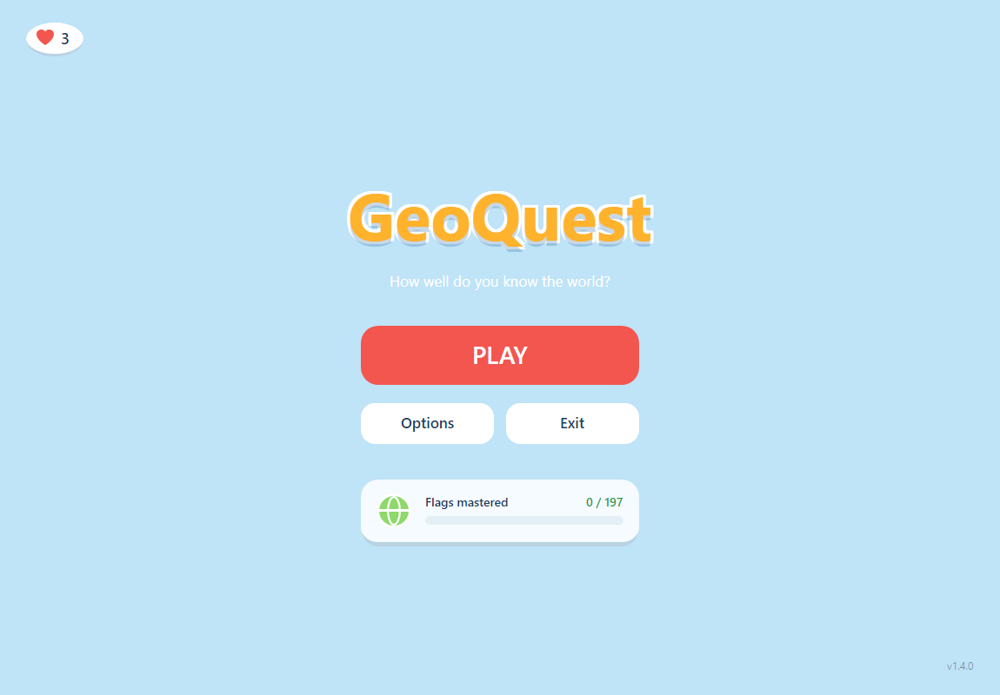
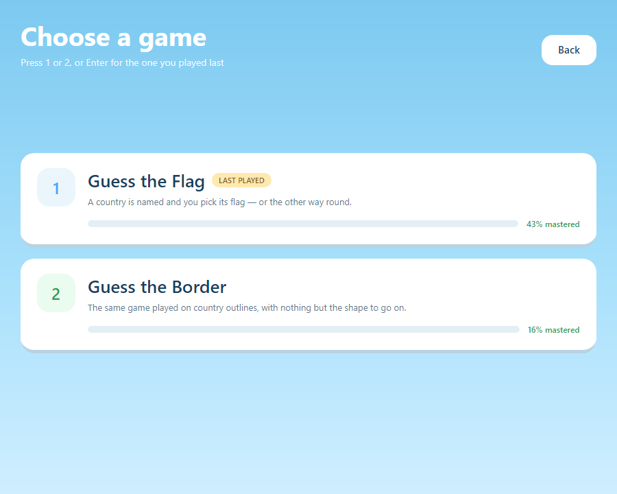
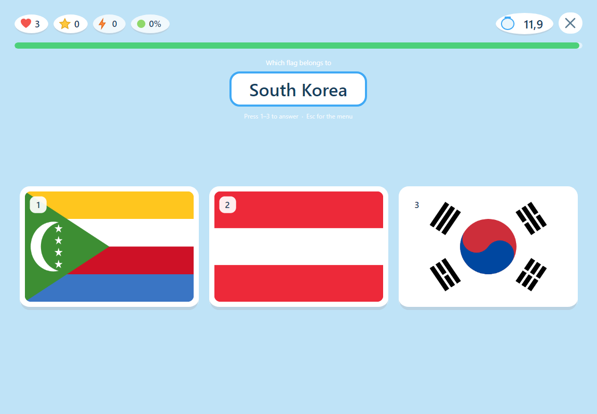
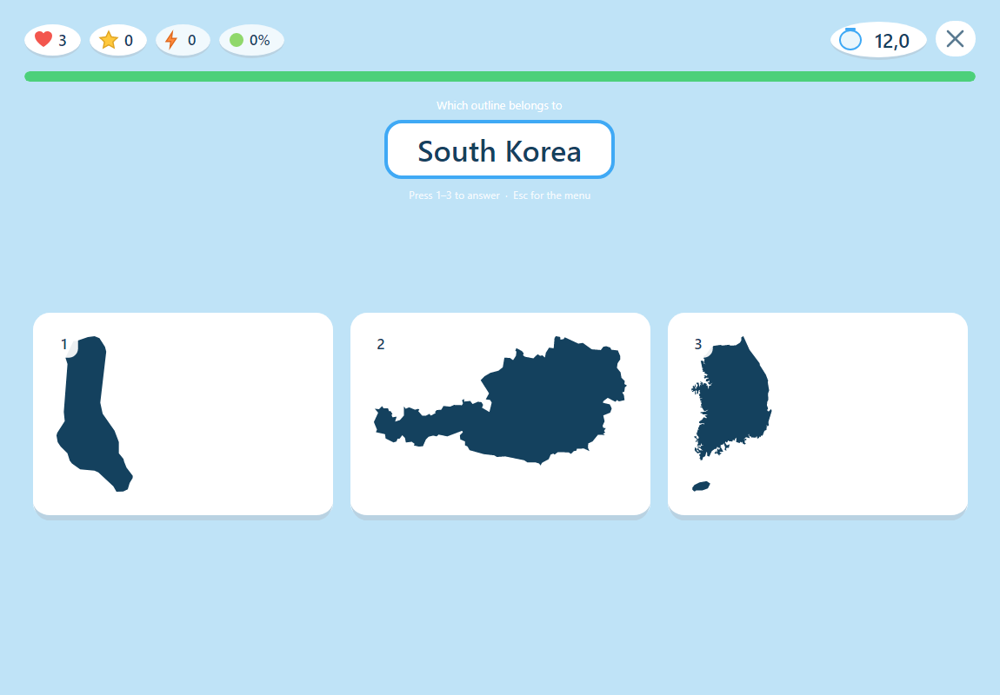
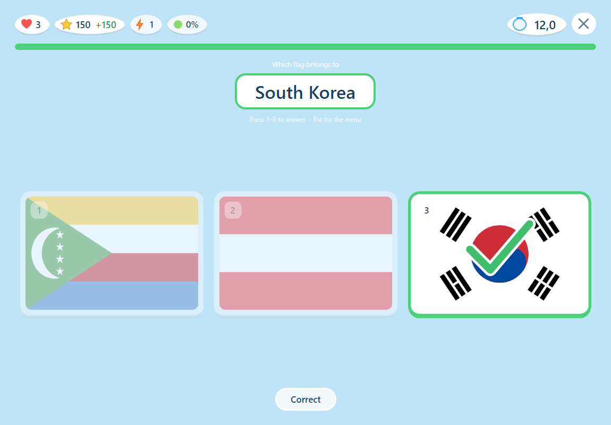
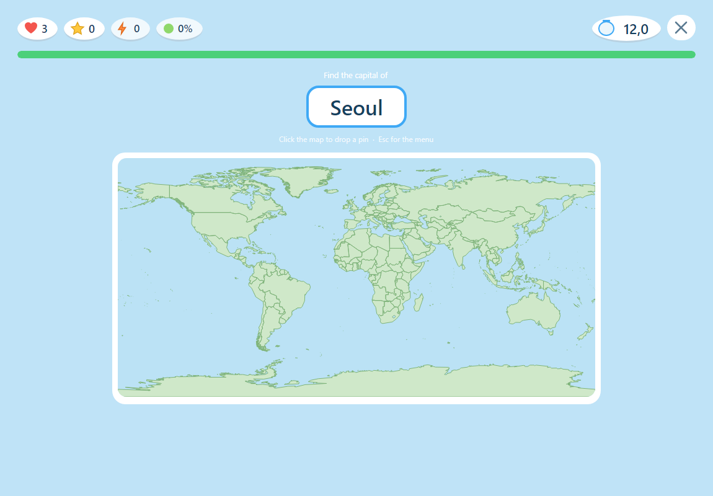

# GeoQuest

**A fast-paced geography trivia game for desktop, built with C# and Avalonia UI.**

Inspired by the classic *Geo Challenge*, GeoQuest is a set of timed mini-games that ask you to identify countries — from their flags, their outlines and their capitals. Answer correctly and it gets harder: more options to choose from, less time to choose.

| | |
| --- | --- |
|  |  |
|  |  |

[](https://dotnet.microsoft.com/download)
[](https://avaloniaui.net/)


## Download

Grab the latest **[release](https://github.com/Thyssen1/GeoQuest/releases/latest)**. Every build is self-contained — the .NET runtime, Avalonia and all the artwork are bundled, so nothing needs installing. Checksums are published as `SHA256SUMS.txt` alongside each release.

| Platform | File | Size |
| --- | --- | --- |
| Windows 64-bit | `GeoQuest-<version>-windows-x64.exe` | ~50 MB |
| macOS (Apple Silicon) | `GeoQuest-<version>-macos-arm64.tar.gz` | ~46 MB |
| macOS (Intel) | `GeoQuest-<version>-macos-x64.tar.gz` | ~46 MB |

Neither build is signed by a paid developer account, so the OS objects on first launch. Neither needs the Terminal.

On **Windows**, choose **More info → Run anyway**.

On **macOS**, extract the tarball and drag **GeoQuest.app** to Applications. Double-click it; macOS says it cannot check the app for malicious software, so click **Done**, then open **System Settings → Privacy & Security** and click **Open Anyway** next to GeoQuest. That is a one-time step — macOS remembers the app afterwards. On macOS 14 and earlier, right-clicking the app and choosing **Open** does the same thing in one step.

The bundle is [ad-hoc signed](.github/workflows/release.yml) during the build, which is what makes that dialog an *unverified developer* prompt with a way past rather than the dead-end **"damaged — move to Trash"** that an unsigned bundle produces. Getting rid of the prompt entirely would mean notarising the app, which requires a paid Apple Developer account.

Your scores, settings and progress live outside the application so they survive upgrades — in `%APPDATA%\GeoQuest\` on Windows, `~/.config/GeoQuest/` elsewhere. That folder holds `player.json`, `settings.json` and `history.json`, kept separate so a corrupt one can never cost you the others. Delete one to reset just that part.

## How it plays

**Play** asks two questions in turn: which game, then which mode. They are independent, so every mode exists for every game.

| Game | A round draws |
| --- | --- |
| **Guess the Flag** | The country's flag |
| **Guess the Border** | The country's outline, with nothing but the shape to go on |
| **Find the City** | A world map, with a capital named and a pin to drop on it |

| Mode | Terms |
| --- | --- |
| **Normal** | The classic run. Three options growing to six, lives from Options, extra lives possible. |
| **Learning** | Twenty rounds at a steady four options on a clock that never tightens, drawn from what you are actually learning. Nothing to lose. |
| **Hard** | Opens at four and climbs to six. Three lives, and no way to earn any back. |
| **Recall** | The question reversed: the picture is shown and you name it, from all 197. |

A pin round has no options to add, so Find the City gets harder the only way it can: the target shrinks on the same thresholds that widen the grid. Normal opens at 800 km and closes to 350, Hard at 500 closing to 200, Learning at a steady 1000.

Each game keeps its own best scores and its own progress, because knowing a country's flag says nothing about whether you would recognise its outline, or place its capital.

**The rules of a run.** The grid opens at three options and grows to four, five and six at 3, 7 and 12 correct answers, while the clock tightens by a second per step. A correct answer is worth 100 points, up to 50% more for answering fast, multiplied by a streak bonus capping at 2×. A wrong pick or a timeout costs a life and resets the streak; a correct answer carries roughly a one-in-eight chance of winning a life back, up to a ceiling of five.



**A pin is judged on great-circle distance**, not on distance across the drawn map, so a near miss in Siberia and one in Indonesia are scored alike. Anything within 50 km counts as dead on — that is under a pixel at map scale, and the score should not turn on which pixel you hit. Past that, the award falls off to a quarter at the edge of what the mode accepts, because knowing roughly where a city is deserves more than nothing.



Answer with the mouse or press **1–6**. **Enter** repeats whatever you played last, and **Esc** steps back one screen at a time. **Options** sets starting lives for Normal runs, turns sound on or off, and resets every best score.

Questions are drawn from the **197 sovereign states**. Territories, the four UK home nations and the EU flag ship with the app but stay out of the pool — offering Scotland alongside the United Kingdom would not be a fair round.

### Learning progress

Every mode records what you show it, because mastery is a claim about what you know rather than about which mode you picked. Each country sits in a box, per game:

- **Unseen** — not yet asked about
- **Boxes 1–3** — being learned. A *quick* correct answer promotes it; a slow one holds it where it is, because at four options a slow correct answer is often a guess that landed. A miss costs a box.
- **Box 4 — mastered.** Out of rotation apart from an occasional re-test. Fail that and it drops to box 2, so the figure falls as well as rises.

The **MASTERED** percentage is box 4 as a share of the pool. Normal mode moves it slowly, drawing uniformly from all 197; Learning mode drives it, working on twenty at a time and returning to them until they graduate.

## Status

| Milestone | State |
| --- | --- |
| **1 — Guess the Flag** | ✅ Playable |
| **2 — Guess the Border** | ✅ Playable |
| **3 — Find the City** | ✅ Playable |

## Building

Requires the [.NET 10 SDK](https://dotnet.microsoft.com/download). Nothing else — the assets are committed, so a fresh clone runs as-is.

```bash
git clone https://github.com/Thyssen1/GeoQuest.git && cd GeoQuest && dotnet run
```

```bash
dotnet test
```

The solution defines **Debug** and **Release** for both **Any CPU** and **x64**; the x64 configurations write to `bin/x64/`, leaving the Any CPU output untouched. Standalone builds come from the publish profile:

```bash
dotnet publish -p:PublishProfile=win-x64
```

macOS is deliberately **not** published as a single file — a plain publish into `GeoQuest.app/Contents/MacOS` keeps every binary inside the bundle, where single-file publishing would extract dylibs to a temp directory at runtime and complicate notarising later. It ships as a **tarball, not a zip**, because tar preserves the executable bit and the app will not launch without it. See [release.yml](.github/workflows/release.yml) for the exact commands.

**Trimming is off, deliberately.** It halves the executable but the app then crashes on startup: `System.Text.Json` needs a source-generated context, and Avalonia's `ViewLocator` resolves views by reflection. Both are flagged `IL2026` at publish time, and both must be fixed before trimming — or NativeAOT — is possible.

### Cutting a release

Document the version in `ChangeLog.txt` first — **the workflow refuses to build a version the changelog does not mention** — then tag and push:

```bash
git tag -a v1.3.1 -m "GeoQuest 1.3.1" && git push origin v1.3.1
```

The workflow runs the tests on every target platform, builds the three artifacts in parallel with `Version` taken from the tag, and publishes the release with checksums. Two things fail it before anything compiles: a version that is not `major.minor.patch`, and a version missing from the changelog. To rehearse without tagging, run it manually from the Actions tab — that builds and uploads artifacts but creates no release.

## How it is put together

C# and Avalonia UI 12, MVVM via [CommunityToolkit.Mvvm](https://learn.microsoft.com/dotnet/communitytoolkit/mvvm/). Bindings are compiled (`AvaloniaUseCompiledBindingsByDefault`), so views declare `x:DataType` and binding errors surface at build time.

```
GeoQuest/
├── Assets/            # Compiled as AvaloniaResource
│   ├── countries.json # ISO code -> name, region, kind
│   ├── Flags/         # *.svg sources (not shipped), *.png generated (shipped)
│   ├── Sounds/        # 16-bit PCM WAVs, generated
│   ├── Borders/       # Country outlines as unit-square polygons, generated
│   ├── Cities/        # Capitals with coordinates, generated
│   └── Maps/          # The world in one equirectangular projection, generated
├── Models/            # Domain types and the pure rules (GameRules, LearningRules)
├── Services/          # Data access, question generation, asset loading
├── ViewModels/        # Presentation state and commands
├── Views/             # Avalonia XAML and code-behind
├── Styles/Theme.axaml # Palette and shared control styles
├── tools/             # Dev-time asset generators, not part of the app
└── tests/
```

**Views** bind to **ViewModels**, which use **Services**, which return **Models**. Nothing flows the other way: Models never reference Avalonia, which is what keeps the rules unit-testable and portable to mobile later. Two interfaces survive where there are genuinely two implementations to choose between — `IQuestionGenerator` (uniform or box-driven) and `ICountryArtwork` (flags or outlines).

`MainWindowViewModel` is the shell: it owns which page is on screen and the lifetime of each. Pages never navigate themselves — they raise intent and the shell decides what it means. The chosen game and mode resolve to a `DifficultyProfile`, which holds lives, bonus-life odds, grid width, clock and session length as *values* rather than as branches through the rules; a run is built fresh from it and disposed when it ends.

Four adapters know about `avares://` so nothing else has to: `AssetCountryData`, `FlagImageLoader`, `OutlineLoader` and `CityLoader`.

## Assets

Everything ships through one wildcard, so new files are picked up automatically:

```xml
<AvaloniaResource Include="Assets\**" Exclude="Assets\Flags\*.svg" />
```

Embedding as resources rather than loose files is what makes them work identically on desktop and on mobile, where the bundle is read-only.

Three generators live in `tools/`, each committed so assets can be rebuilt from source:

| Run | Produces |
| --- | --- |
| `dotnet run --project tools/FlagConverter -- --height 320 --fill --force` | 480×320 flag PNGs from the SVG sources |
| `dotnet run --project tools/SoundMaker` | The three answer sounds as WAVs |
| `dotnet run --project tools/BorderBaker -- --input <ne_10m_admin_0_countries.shp> --world` | `borders.json` — 197 outlines, ~450 KB — and `world.json`, the map behind Find the City |
| `dotnet run --project tools/CityBaker -- --input <ne_10m_populated_places.shp>` | `cities.json` — 197 capitals, ~12 KB |

**Flags** are keyed by lowercase ISO 3166-1 alpha-2 (`dk.png`), and every PNG is stretched to an identical 480×320 canvas. That trades true proportions for a perfectly uniform grid, which is why the view uses `Stretch="Fill"`. `countries.json` must stay in sync — 255 entries, 255 images — and its ISO code is the single join key across every mini-game.

**Sounds** are synthesised rather than sourced, so the audio is ours to ship with no licence to track and no decoder to carry. Playback borrows whatever the host provides: winmm on Windows, `afplay` on macOS, PulseAudio or ALSA on Linux. Every failure path is silent — no device, no player, nowhere to unpack to, and the round carries on.

**Outlines** are baked from Natural Earth's public-domain *Admin 0 – Countries* shapefile, which is ~10 MB and not kept in the repository; download it from [Natural Earth](https://www.naturalearthdata.com/downloads/) to re-bake. The baker has three jobs, each of which produces a nonsense silhouette if skipped: normalising every country onto its own square so Russia and Monaco present comparably; dropping distant territories, so France is the hexagon rather than a speck beside French Guiana; and handling the antimeridian, where Russia and Fiji otherwise smear across the world.

**The world map** is baked from the same shapefile with `--world`, and makes the opposite choice at every turn: one shared equirectangular projection instead of a square each, no latitude squeeze, and islands kept rather than pruned. Each country's largest landmasses are drawn however small they are, because Tonga and Tuvalu fall under any sensible size floor and a map without them is one the game can ask unanswerable questions about.

**Capitals** come from Natural Earth's *Populated Places*. Eight countries need correcting by hand, each an entry in one table in the baker: four have no usable capital in the data — Kosovo's code is `-99`, South Sudan's flag was never set after independence, Palestine has none flagged, and Nauru has no city at all — three flag several, where taking the largest yields Cape Town and Abidjan rather than Pretoria and Yamoussoukro, and Kazakhstan still says Nur-Sultan, renamed back to Astana a few months after this release of the data.

## Credits

Flag artwork comes from [hampusborgos/country-flags](https://github.com/hampusborgos/country-flags), sourced from Wikimedia Commons and checked against the relevant national legislation. That project states the flags are **in the public domain**, on the basis that flags are not subject to copyright — while noting that individual countries may impose separate, non-copyright restrictions on their use. Only the SVG sources are taken from upstream; the PNGs here are generated from them.

Country outlines, the world map and the capital cities come from [Natural Earth](https://www.naturalearthdata.com/), which places its data in the public domain.

Country names and `kind` classifications in `Assets/countries.json` were compiled for this project.
