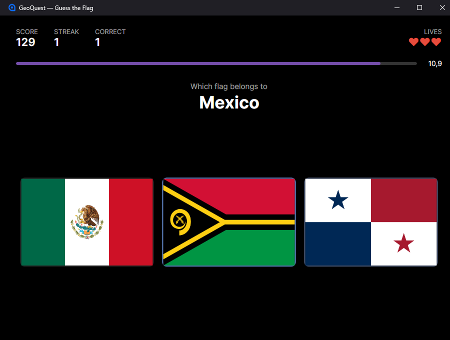

# GeoQuest

**A fast-paced geography trivia game for desktop, built with C# and Avalonia UI.**

Inspired by the classic *Geo Challenge*, GeoQuest is a set of timed mini-games that ask you to identify places from flags, outlines, cities and landmarks. Answer correctly and it gets harder — more options to choose from, less time to choose.

| | |
| --- | --- |
|  |  |

[](https://dotnet.microsoft.com/download)
[](https://avaloniaui.net/)


## Download

Grab the latest **[release](https://github.com/Thyssen1/GeoQuest/releases/latest)**. Every build is self-contained — the .NET runtime, Avalonia and all 255 flag images are bundled, so nothing needs installing.

| Platform | File | Size |
| --- | --- | --- |
| Windows 64-bit | `GeoQuest-<version>-windows-x64.exe` | ~50 MB |
| macOS (Apple Silicon) | `GeoQuest-<version>-macos-arm64.tar.gz` | ~46 MB |
| macOS (Intel) | `GeoQuest-<version>-macos-x64.tar.gz` | ~46 MB |

**Windows:** download and run. The executable is unsigned, so SmartScreen warns on first launch — choose **More info → Run anyway**.

**macOS:** extract and drag `GeoQuest.app` to Applications. Apple Silicon Macs (M1–M4) want `arm64`; Intel Macs want `x64`. The app is unsigned and un-notarised, so Gatekeeper refuses it on first launch — right-click the app and choose **Open**, or clear the quarantine flag:

```bash
xattr -dr com.apple.quarantine /Applications/GeoQuest.app
```

Checksums for every artifact are published as `SHA256SUMS.txt` alongside the release.

Your scores, settings and learning progress are stored per-user, outside the application, so they survive upgrades:

| Platform | Location |
| --- | --- |
| Windows | `%APPDATA%GeoQuest` |
| macOS | `~/.config/GeoQuest/` |
| Linux | `~/.config/GeoQuest/` |

That folder holds `player.json` (best score per mode), `settings.json` and `history.json` (which flags you have learned). They are separate files so a corrupt one can never cost you the others. Delete one to reset just that part.

## How it plays

You are shown a country name and a grid of flags, and you pick the right one before the clock runs out.

- **The grid grows as you improve.** It opens at 3 flags and expands to 4, 5 and 6 at 3, 7 and 12 correct answers.
- **The clock tightens too.** Rounds start at 12 seconds and lose a second per grid size, down to a 7-second floor — so later rounds squeeze on both axes at once.
- **Speed and streaks pay.** A correct answer is worth 100 points, up to 50% more for answering fast, multiplied by a streak bonus that caps at 2×.
- **Three misses ends the run.** A wrong pick or a timeout costs a life and resets your streak.
- **Lucky rounds give one back.** A correct answer carries a small chance — around one in eight — of winning a life, up to a ceiling of five. A long run stays survivable without ever being safe.
- **It says so out loud.** A chime for a right answer, a low tone for a wrong one, and a flourish when a round hands a life back.
- **Your best score persists** between sessions, stored under your user application data directory.

Answer with the mouse, or press **1–6** on the number row or numpad. **Esc** abandons a run and returns to the menu.

**Options** lets you set starting lives for Normal runs (1, 3 or 5), turn sound on or off, reset every best score, and see where your saved data lives.

### Modes

**Play** offers three, and each keeps its own best score — they do not play by the same terms, so one number across all three would mean nothing.

| Mode | Terms |
| --- | --- |
| **Normal** | The classic run. Three flags growing to six, lives from Options, extra lives possible. |
| **Learning** | Twenty rounds at a steady four flags on a clock that never tightens, drawn from the flags you are actually learning. Nothing to lose. |
| **Hard** | Opens at four flags and climbs to six. Three lives, and no way to earn any back. |

Press **1–3** to pick, or **Enter** for the mode you played last.

### Learning progress

Every mode records what you show it, because mastery is a claim about what you know rather than about which mode you picked. Each flag sits in a box:

- **Unseen** — the 197 flags you have not been asked about yet
- **Boxes 1–3** — being learned. A *quick* correct answer promotes a flag; a slow one holds it where it is, because at four options a slow correct answer is often a guess that landed. A miss costs a box.
- **Box 4 — mastered.** Out of rotation, apart from an occasional re-test. Fail that and the flag drops back to box 2, so the number can fall as well as rise.

The **MASTERED** figure on the scoreboard is box 4 as a share of the pool. Normal mode moves it slowly — it draws uniformly from all 197, so the same flag comes round rarely. Learning mode drives it: it works on twenty flags at a time and returns to them until they graduate, letting new ones in only as others are learned.


Questions are drawn from the **197 sovereign states**. Territories, the four UK home nations and the EU flag ship with the app but are kept out of the question pool — offering Scotland alongside the United Kingdom would not be a fair round.

## Status

| Milestone | State |
| --- | --- |
| **1 — Guess the Flag** | ✅ Playable |
| 2 — Guess the Border | Not started |
| 3 — Find the City | Not started |
| 4 — Find the Landmark | Not started |

## Getting Started

Requires the [.NET 10 SDK](https://dotnet.microsoft.com/download). No other setup — the flag assets are committed, so a fresh clone runs as-is.

```bash
git clone https://github.com/Thyssen1/GeoQuest.git
cd GeoQuest
dotnet run
```

Run the tests:

```bash
dotnet test
```

### Build configurations

`GeoQuest.sln` defines **Debug|Any CPU**, **Debug|x64**, **Release|Any CPU** and **Release|x64**. The x64 configurations produce genuinely 64-bit assemblies (`Amd64` rather than `MSIL`) in `bin/x64/`, leaving the AnyCPU output in `bin/` untouched.

```bash
dotnet build GeoQuest.sln -c Release -p:Platform=x64
```

The classic `.sln` format is used deliberately over the newer `.slnx`, which requires Visual Studio 2022 17.14+ or Rider 2025.

### Building the standalone executable

```bash
dotnet publish -p:PublishProfile=win-x64
```

Output lands in `bin/publish/win-x64/GeoQuest.exe` — one self-contained file, roughly 50 MB. Settings live in [Properties/PublishProfiles/win-x64.pubxml](Properties/PublishProfiles/win-x64.pubxml).

For Linux, swap the runtime identifier:

```bash
dotnet publish -c Release -r linux-x64 --self-contained -p:PublishSingleFile=true -p:EnableCompressionInSingleFile=true
```

### Building for macOS

macOS is **not** built as a single file. A plain publish into `GeoQuest.app/Contents/MacOS` keeps every binary inside the bundle, whereas single-file publishing extracts native dylibs to a temp directory at runtime — which is awkward to notarise later.

```bash
dotnet publish GeoQuest.csproj -c Release -r osx-arm64 --self-contained true \
  -p:DebugType=none -o GeoQuest.app/Contents/MacOS
sed "s/__VERSION__/1.0.0/g" build/macos/Info.plist > GeoQuest.app/Contents/Info.plist
chmod +x GeoQuest.app/Contents/MacOS/GeoQuest
tar -czf GeoQuest-macos-arm64.tar.gz GeoQuest.app
```

Use `osx-x64` for Intel Macs. The bundle is ~115 MB uncompressed and ~46 MB tarred.

A **tarball, not a zip** — tar preserves the executable bit, and without it the app will not launch. This matters especially when building on Windows, whose filesystem does not carry that bit at all.

Code signing and notarisation are not set up. That requires an Apple Developer ID and a macOS machine, so it can only run on the `macos-latest` job.

**On trimming:** `PublishTrimmed` cuts the executable from 50 MB to 24 MB, but the app then **crashes on startup**:

```
System.InvalidOperationException: Reflection-based serialization has been disabled
   at GeoQuest.Services.JsonCountryRepository.Load(Stream json)
```

Two things stand in the way, both flagged as `IL2026` at publish time. `System.Text.Json` uses reflection unless given a source-generated `JsonSerializerContext`, and Avalonia's default `ViewLocator` resolves views by reflection — [ViewLocator.cs](ViewLocator.cs) carries a `RequiresUnreferencedCode` attribute saying exactly that. Fixing both is a prerequisite for trimming, and for NativeAOT later.

### Cutting a release

Releases are built by [.github/workflows/release.yml](.github/workflows/release.yml), triggered by pushing a version tag:

```bash
git tag -a v1.0.0 -m "GeoQuest 1.0.0"
```

```bash
git push origin v1.0.0
```

The workflow runs the test suite on **every** target platform, then builds three artifacts in parallel — Windows x64, macOS arm64 and macOS x64 — with `Version` taken from the tag. It publishes a `SHA256SUMS.txt` covering all of them and creates the GitHub Release with notes generated from the commit history.

To rehearse without tagging, run the workflow manually from the Actions tab. `workflow_dispatch` performs every build and uploads the artifacts, but skips creating a release.

Note that the version must match `major.minor.patch`; the workflow fails fast otherwise rather than producing a mislabelled build.

## Tech Stack

| Concern | Choice |
| --- | --- |
| Language | C# |
| UI framework | Avalonia UI 12 |
| Architecture | MVVM |
| MVVM toolkit | [CommunityToolkit.Mvvm](https://learn.microsoft.com/dotnet/communitytoolkit/mvvm/) 8.4 |
| Target framework | .NET 10 |

Bindings use `AvaloniaUseCompiledBindingsByDefault`, so views declare `x:DataType` and binding errors surface at compile time rather than at runtime.

### Platform targets

The repository currently builds a **desktop** application. Mobile — iOS in particular — is an explicit goal.

To keep that path open, all game logic stays platform-agnostic: no `System.Windows`, no desktop-only file-system assumptions, no P/Invoke. Models, Services and ViewModels are portable as-is. When mobile is added, the project will split into a shared library plus per-platform heads (`GeoQuest.Desktop`, `GeoQuest.iOS`), which requires the relevant workload:

```bash
dotnet workload install ios
```

## Project Structure

```
GeoQuest/
├── Assets/            # Images and static data compiled as AvaloniaResource
│   ├── countries.json # ISO code -> name, region, kind
│   ├── Flags/         # Country flags, named by ISO 3166-1 alpha-2 code
│   │                  #   *.svg = sources (not shipped), *.png = generated (shipped)
│   └── Sounds/        # Answer sounds as 16-bit PCM WAVs, generated by tools/SoundMaker
├── Models/            # Plain domain types (Country, FlagQuestion, GameRules)
├── Services/          # Data access and question generation behind interfaces
├── ViewModels/        # Presentation state and commands (CommunityToolkit.Mvvm)
├── Views/             # Avalonia XAML views and their code-behind
├── tools/
│   ├── FlagConverter/ # Dev-time SVG -> PNG rasteriser (not part of the app)
│   └── SoundMaker/    # Dev-time WAV synthesiser (not part of the app)
├── tests/
│   └── GeoQuest.Tests/ # xUnit suite over rules, data and question generation
├── App.axaml          # Application entry point, themes and styles
├── Program.cs         # Desktop bootstrapper
└── ViewLocator.cs     # Convention-based ViewModel → View resolution
```

The layering rule: **Views** bind to **ViewModels**, which depend on **Services** through interfaces, which return **Models**. Nothing flows the other way — Models and Services never reference Avalonia types. This is what keeps the game logic unit-testable and portable to mobile.

### Navigation

`MainWindowViewModel` is the shell. It owns which page is on screen (`CurrentPage`) and the lifetime of each one; `ViewLocator` resolves each page ViewModel to its View by naming convention.

Pages never navigate themselves — they raise intent (`PlayRequested`, `ModeChosen`, `BackRequested`, `MenuRequested`) and the shell decides what that means. That keeps navigation rules in one file rather than scattered across screens.

**Play** opens the mode chooser, and the chosen mode resolves to a `DifficultyProfile` — lives, bonus-life odds, grid width and session length as values rather than as branches through the rules. A run is constructed fresh from that profile and disposed when it ends, so settings changed in Options take effect immediately and no timers keep running behind the menu.

Two small adapters are the deliberate exception: `FlagImageLoader` and `AssetCountryData` know about `avares://`, so nothing else has to.

`tools/` and `tests/` are removed from the root project's compile globs — the app project lives at the repository root, so its default `**/*.cs` would otherwise compile both into the game.

## Assets Strategy

### Flags

Flag images live in `Assets/Flags`, named by their **ISO 3166-1 alpha-2 code, lowercased**:

```
Assets/Flags/dk.png
Assets/Flags/us.png
Assets/Flags/mx.png
```

SVG files are the **source of truth**; the `.png` files beside them are **generated** and are what the app ships.

Every generated PNG is exactly **480×320**. Source flags have wildly different true proportions — Nepal is 0.83:1 and the only taller-than-wide national flag, Qatar is 2.55:1, Denmark 1.32:1 — and each is **stretched to fill** the shared canvas. This is a deliberate trade: a perfectly uniform grid, at the cost of showing flags at other than their official proportions. Because every image is identical in size and ratio, the view renders with `Stretch="Fill"` and every tile matches.

### Regenerating the PNGs

The game loads PNGs through Avalonia's built-in `Bitmap`, which keeps the app free of any SVG rendering dependency. Conversion happens at dev time via a committed tool:

```bash
dotnet run --project tools/FlagConverter -- --height 320 --fill --force
```

Existing PNGs newer than their source are skipped, so `--force` is needed when changing output mode. Three modes are available:

| Flag | Output |
| --- | --- |
| `--fill` | Stretch to fill the shared canvas. Uniform size, distorted proportions. **Current setting.** |
| *(default)* | Centre on the shared canvas with transparent padding. Uniform size, true proportions, visible padding. |
| `--native` | Pin height only, width follows the source `viewBox`. True proportions, ragged grid. |

`--ratio` sets the canvas shape (default `1.5`, i.e. 3:2). Re-run after adding or updating any flag.

Switching mode requires a matching change to the `Image` in [Views/GameView.axaml](Views/GameView.axaml): `Stretch="Fill"` suits `--fill`, while the other two modes want `Stretch="Uniform"`.

The `tools/` directory is excluded from the main project's compile globs, and `Assets/Flags/*.svg` is excluded from `AvaloniaResource`, so the SVG sources stay in the repo without being embedded in the shipped app.

### Country metadata

`Assets/countries.json` holds one entry per flag, keyed by ISO code:

```json
{ "code": "dk", "name": "Denmark", "region": "Europe", "kind": "sovereign" }
```

`kind` is one of `sovereign`, `territory`, `subdivision` or `other`, and is what filters the question pool. `region` is unused by Milestone 1 but is in place for regional filtering and the later map milestones.

The file and the flag directory must stay in sync — **255 entries, 255 images**, matched by code in both directions. The ISO code is the single join key across every mini-game: it links a flag image, a country outline and a set of cities to one country record.

### Sounds

The three answer sounds are synthesised rather than sourced: `tools/SoundMaker` writes them as short 16-bit PCM WAVs, so the audio is ours to ship with no licence to track and no decoder to carry. Re-run it after changing a voice:

```bash
dotnet run --project tools/SoundMaker
```

Playback uses whatever the host already provides — winmm on Windows, `afplay` on macOS, PulseAudio or ALSA on Linux — which keeps an audio stack and its native binaries out of a drop that already carries Skia. Because those players read files and Avalonia resources are not files, `SystemSoundPlayer` unpacks each WAV once, into a `sounds/` folder beside the player's save data rather than into the shared system temp directory. Everything about sound fails silently: no audio device, no player installed, nowhere to unpack to, and the round carries on regardless.

### Build action

All assets are compiled with the `AvaloniaResource` build action, configured in `GeoQuest.csproj` with a wildcard, so **new files are picked up automatically** — no per-file edits needed:

```xml
<AvaloniaResource Include="Assets\**" Exclude="Assets\Flags\*.svg" />
```

Embedding assets as resources rather than shipping loose files is what makes them work identically on desktop and on mobile, where the app bundle is read-only and loose-file paths are unreliable. Assets are addressed with the `avares://` scheme:

```csharp
var uri = new Uri($"avares://GeoQuest/Assets/Flags/{isoCode}.png");
using var stream = AssetLoader.Open(uri);
var bitmap = new Bitmap(stream);
```

## Roadmap

### Milestone 1 — "Guess the Flag" ✅

Complete. See [How it plays](#how-it-plays) for the rules as implemented.

### Milestone 2 — "Guess the Border"

Identify a country from its outline/silhouette alone. Requires country geometry rendered from vector data, plus a normalisation pass so wildly different country sizes present at a comparable, fair scale.

### Milestone 3 — "Find the City" (World Map)

Drop a pin on a blank world map as close to a target city as possible. Scoring is distance-based rather than binary, which requires a map projection and a great-circle distance calculation between the guess and the true coordinates.

### Milestone 4 — "Find the Landmark"

Pinpoint famous global monuments on the world map. Shares the pin-drop and distance-scoring mechanics from Milestone 3, with a landmark dataset in place of cities.

### Future scope

Country-specific and sub-national modes, reusing the Milestone 3 map and scoring machinery at a tighter zoom:

- "Find the city in Denmark"
- "Find the city in the United States"
- "Find the city in Mexico"
- "Find the State/Region" — identify sub-national divisions

## Credits

Flag artwork comes from [hampusborgos/country-flags](https://github.com/hampusborgos/country-flags), a set of accurate flag renders sourced from Wikimedia Commons and checked against the relevant national legislation. That project states the flags are **in the public domain**, on the basis that flags are not subject to copyright protection — while noting that individual countries may impose separate, non-copyright restrictions on how their flag is used.

Only the SVG sources are taken from upstream. The `.png` files in this repository are generated from them by `tools/FlagConverter` and are not upstream artifacts. Upstream also ships pre-rendered PNGs at 100/250/1000px widths; GeoQuest does not use them, because it needs a uniform 480×320 canvas rather than native proportions.

The naming convention here follows upstream directly: ISO 3166-1 alpha-2, plus the six-character `gb-eng`/`gb-sct`/`gb-wls`/`gb-nir` codes for the UK's constituent countries, and the user-assigned `xk` for Kosovo.

Country names, regions and `kind` classifications in `Assets/countries.json` were compiled for this project and are not from upstream.
